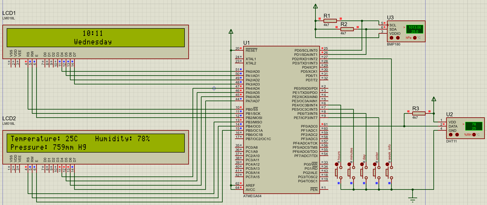
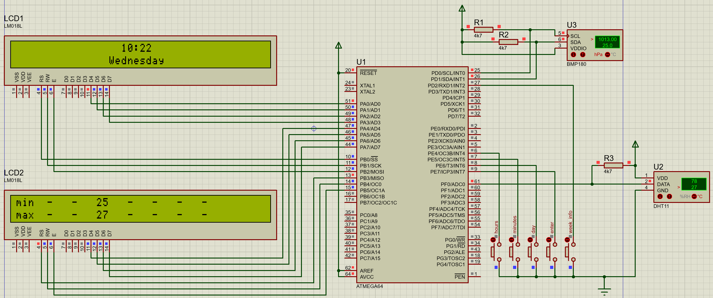

# Электронная метеостанция на микроконтроллере AVR
Модель бытовой электронной метеостанции на ATmega64.

## Стек
* C
* Микроконтроллер: AVR ATmega64
* Датчики: DHT11, BMP180
* Дисплей: LM018L

## Функционал
* устройство может измерять температуру, влажность воздуха и атмосферное давление
* измерения и время отображаются на дисплее
* измерения осуществляются каждые 10 минут
* с помощью кнопок можно настроить время и день недели
* по нажатию на кнопку `week_info` отображается минимальная и максимальная температура за неделю. При отсутствии данных отображается `-`

## Скриншоты симуляции

## Структура репозитория
    /
    ├─ doc/
    │  ├─ circuit_diagram.png
    ├─ course_project_atmega64.pdsprj
    ├─ cp_atmega64_final.hex
    ├─ main.c
    ├─ README.md
